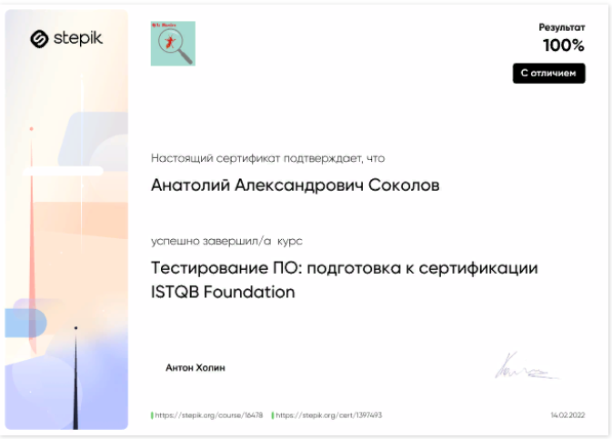

# Дипломный проект Анатолия Соколова #

## Мой путь в ручное тестирование ПО ##

### Вместо предисловия ###

  *В данной работе я хочу рассказать от первого лица как я пришел в ИТ, как выбирал программы и платформы для своего обучения и чему научился за неполные 6 месяцев. Возможно что-нибудь из моего личного опыта поможет кому-нибудь ещё.*

### Оглавление ###

1. Почему я решил стать ИТ специалистом.
2. Муки выбора специальности.
3. Поиски вариантов обучения.
4. Коротко об обучении на курсе "Project manager в IT: старт карьеры руководителя ИТ проектов".
5. Обучение на курсе  "Ручное тестирование. ИТ-специалист интенсив" в GeekBrains.
6. Введение в програмирование.
7. Введение в контроль версий.
8. Знакомство с языками программирования.
9. Буткемп ИТ-специалист. Ручное тестирование.
10. Математика и информатика для программистов.
11. Переход на курс "Ручное тестирование. ИТ-специалист интенсив".
12. Гибкие методологии(Agile, SCRUM, Kanban и другие).
13. Знакомство с WEB технологиями.
14. Введение в тестирование.
15. Тест дизайн и тест аналитика.
16. Знакомство с базами данных.
17. Как я писал эту работу.
18. Обучение через "Госуслуги".
19. Планы на будущее.

### 1. Почему я решил стать ИТ специалистом ###

    Я уже не молод, но ещё и не стар. Мне 49 лет.
В апреле этого 2022 года я неожиданно остался без работы. Иностранная компания из очень дружественной России страны, в которой я работал последние три года, решила в условиях неопределенности минимизировать возможные риски, связанные с проведением РФ специальной военной операции. Компания  сократила большинство своих сотрудников, в том числе и меня , закрыла множество своих филиалов в России и перевела оставшуюся часть бизнеса на систему ответственного хранения в малые предприятия.

    Соответственно, я задумался как жить дальше и чем же ещё заняться. Мне захотелось сменить профессию.
 В прошлом я уже имел опыт переобучения и смены специальности.
 Проанализировав современные тенденции, я сделал выводы, что повсеместная глобальная цифровизация потребует большого количества специалистов в ИТ сфере.

 Меня очень мотивировали мои родственники. У меня троюродный брат программист, архитектор, кандидат наук по информатике. Сын сейчас сеньор, QA инженер , занимается тестированием банковских приложений. И если у брата изначально высшее образование по информатике, то сын пришел в ИТ, что называется "с улицы". Я на его примере увидел, как можно за три года пройти путь от стажёра, до высококвалифицированного и высокооплачиваемого ИТ-специалиста. Я осознал, что образовательные процессы сильно изменились, что сейчас можно обучаться с использованием дистанционных технологий самостоятельно. Узнал, что есть как бесплатные курсы , так и платное образование на различных платформах.

### 2. Муки выбора специальности ###

    Что же выбрать? По какому пути пойти?
Брат много интересного порассказал. Он по натуре созидатель. Посоветовал мне начать обучение с изучения какого-нибудь современного языка программирования, например, Java, Java Script или Python.  Я попрбовал, буквально чуть чуть?, поучить самостоятельно Rython. Мне показалось это довольно сложным. Нужно отметить, что основное образование у меня юридическое. Но так как я много работал в государственных структурах на руководящих должностях, то мне пришлось изучать и работать в разных офисных программах. Я самостоятельно научился работать в различных CRM, изучил и работал несколько лет в 1С.Работал в нескольких ведомственных специализированных программах. То есть у меня есть опыт работы с ПО , как пользователя.

Сын же подал мне идею попробовать себя в ручном тестировании. Он буквально на пальцах бысторо объяснил мне что тестировщик ищет расхождения между ожидаемым результатом работы ПО и фактическим результатом. Посоветовал мне посмотреть ролики на канале блогера Лёши Маршала вроде этого: "https://www.youtube.com/watch?v=3kgdKE7ndvI&t=171s" .

Самого же меня мучил вопрос, как применить свои имеющиеся soft и hard скиллы? Я много лет руководил различными коллективами. Решал разные поставленные передо мной задачи. Выстраивал коммуникации, как внутри команды, так и между различными гос.органами и структурами. Осуществлял взаимодействие со СМИ. Брата моего тоже в один момент вдруг осенило, что я хороший руководитель и я могу расскрыть свой потенциал в качестве Project менеджера или SCRUM мастера, например. Он был и руководителем проектов и Team лидом. Прекрасно разбираясь в вопросе и зная мой потенциал, он предложил мне попробовать  поискать себя в этом направлении.

### 3. Поиски вариантов обучения ###

   Где научиться? Какие документы об образовании имеют вес при трудоустройстве? Учиться платно или без оплаты - нюансы?!
Сначала я решил попробовать бесплатные курсы, т.к. до конца не был уверен, какую специализацию выбрать. Сын посоветовал мне платформу  Stepic, так как сам там проходил некоторые курсы. Я  попробовал поучить Python 'https://stepik.org/course/Инди-курс-программирования-на-Python-63085/', но мне показалось сложно с этого начинать. Этот курс я бросил через пару уроков и до сих пор к нему не вернулся.

После объяснения мне сыном про тестирование ПО я решил пройти курс по Тестированию ПО 'https://stepik.org/course/Тестирование-ПО-подготовка-к-сертификации-ISTQB-Foundation-16478/' и у меня получилось. Я прошел весь курс и получил сертификат об окончании 'https://stepik.org/cert/1397493#:~:text=https%3A//stepik.org/cert/1397493' .  Мне казалось, что я уже тестировщик, но очень быстроя понял, что сертификаты с бесплатных курсов практически не учитываются HR-ми, как профильное образование.

В то же время имеют вес профильные дипломы и сертификаты об образовании таких образовательных платформ как  GeekBrains, SkillBox, Академии Yandex и др.

Я стал выяснять можно ли получить образование от именитых преподавателей без оплаты или со скидками. Ведь в это время у меня не было работы. Я выяснил, что существует проект "Цифровые профессии" на сайте "Госуслуги" 'https://profidigital.gosuslugi.ru/'в рамках которых лица, официально признанные безработными и состоящие на учете в центре занятости населения в качестсве безработного, могут обучиться со 100% скидкой за счет государства.

Замечу, что на сайте "Госуслуги" в разделе "Цифровые профессии" есть более 130 курсов по напрвлениям "Программирование", "Мобильная разработка", "Дизайн", "Аналитика", "Искусственный интелект". Представлены курсы от "GeekBrains", "Skillbox", " Яндекс", "Innopolis University"  и др. Я решил воспользоваться гос.поддержкой и встал на учет в качестве безработного в центр занятости.

Я думал, что всё будет просто, но оказалось, что есть ***нюансы***.

***Специально выделю этот момент (смотри абзац ниже)***, так как ***он точно поможет*** тому, кто будет признан официально ***безработным получить какое-либо образование без оплаты, за счет государства.***

 ***И так. Я пришел в центр занятости, согласно адреса своей регистрации. Предоставил паспорт, трудовую книжку и справку с последнего места работы о среднем заработке за последние 6 месяцев. Я сразу же предупредил сотрудников ЦЗН, что хотел бы отучиться нк курсах в рамках предлагаемых вариантов на сайте "Госуслуги". На что сотрудники ЦЗН мне на "голубом глазу" сообщили, что не работают через "Госуслуги" "уже давно"! Что на курсы через "Госуслуги" записаться не возможно и обязательно нужно, если я хочу учиться от государства, зарегистрироваться на сайте "Работа в России" 'https://trudvsem.ru/'. Меня настоятельно напрвляли на этот сайт, заявляя, что только зарегистрировавшись там, я смогу поступить на бесплатное обучение по программам обучения граждан в рамках федерального проекта "Содействие занятости" национального проекта "Демография" 'https://trudvsem.ru/information-pages/support-employment/'. Я не сразу поверил словам сотрудницы центра занятости и попытался самостоятельно, через "Госуслуги" записаться, но не смог. На одном из этапов сайт "Госуслуги" просто не давал пройти дальше и всё!!! При очередном посещении центра занятости, я услышал о подобной проблеме ещё от нескольких таких же посетителей, как и я сам. И мне не осталось ни чего более, как пойти по пути, указанному в ЦЗН и зарегистрироваться на сайте "Работа в России". Через 9 рабочих дней, после первого посещения ЦЗН я был признан официально безработным, мне начислии пособие по безработице и сказали, что теперь я могу выбрать нужную мне программу обучения в рамках федерального проекта "Содействие занятости".***

 Остановлюсь немного на данном процессе. Во первых программы там абсолютно другие, чем на "Госуслугах". По ИТ направлению их там гораздо меньше и образовательные учреждения представлены гораздо скуднее. Но использовать предоставленную возможность очень хотелось, поэтому я решил не упускать свой шанс на бесплатное обучение и записался на курс "Project manager  в IT:старт карьеры руководителя  ИТ проектов" Выбирал из того, что было и решил прокачать свой прошлый управленческий опыт и получить новую квалификацию. Забегая вперёд, скажу, что данный курс я окончил.  Мне выдали соответствующий сертификат и свидетельство о повышении квалификации.

 ***Ещё один нюанс , кроме всего прочего меня обязали до 01.01.2023 года устроиться на работу либо оформить самозанятость - в противном случае с меня могут взыскать полную стоимость обучения!***

Однако, ***меня очень заинтересовали программы обучения, представленные на "Госуслугах", в частности курсы от GeekBrains***. Так как я постоянно искал различные курсы в интернете, мне стала поступать контекстная реклама от разных сайтов по обучению. Я изучил рейтинги образовательных платформ. И решил продолжить обучение за плату в  Geekbrains. ***На платформе GeekBrains  'https://gb.ru/'я увидел много разных образовательных курсов. Так же был приятно удивлён скидками на оплату обучения. Мне предоставили скидку 45% на оплату обучения с рассрочкой на 36 месяцев***. Чем я и воспользовался. Решил вложить немного заработанных в своё дальнеёшее ИТ-образование. ***Я поступил на факультет "IT- специалист", где в данное время и заканчиваю обучение  на курсе "Ручное тестирование.ИТ специалист интенсив"***.

Но и это ещё не вся история! ***Совсем недавно я выяснил, что через  "Госуслуги" всё-таки возможно получить образование по ИТ специальностям бесплатно! Это возможно даже, если вы уже отучились от Центра занятости за государственный счет! Как это сделать я опишу в конце всей этой работы. **АННОНС!!!** Будут мои домыслы, почему у меня и других не получалось отучиться через Госуслуги"? Кто виноват? И что делать? Опишу свой собственный опыт!***
